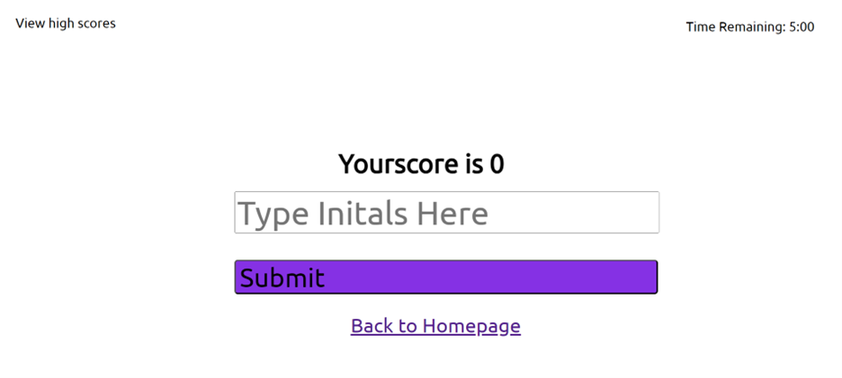

# Code-Quiz

A Coding Quiz

## Description

This webpage was created for the user to test their coding basics knowledge in a fun way.

## Table of Contents
- [Description](#description)
- [Badges](#badges)
- [Usage](#usage)
- [License](#license)
- [GitHub-repository](#github-repository)
- [Deployed-application-link](#deployed-application-link)

## Badges

## Usage

To use this webpage the user has the option of either starting the quiz by clicking the start quiz button or clicking the view highscores to bypass the quiz.

If the user decides to click on the start quiz button it will initiate the quiz with the first question as well as start the timer of 5 minutes. If the user picks an incorrect answer their time will drop by 10 seconds. If they answer correctly they can move on without penalties.

Once the user has finished all of the questions and they have pressed submit they are presented with their total correct points earned and a type box to be able to place their initials should they want to save it to the leaderboard. If the user chooses to bypass adding the initials, their score will still be placed but it will be anonymous. They will also be given the option of returning to the homepage should they want to try again.

Once the user clicks the submit button in the previous page they are directed to the leaderboard which holds all of the highscores. If the user at the beginning opted out of going through with the quiz, the view high scores link would also have allowed them to get to this screen. They also have the option of returning to the homepage should they want to try again after saving their score.

## License

## Deployed-application-link
https://nicolet27.github.io/Code-Quiz/
